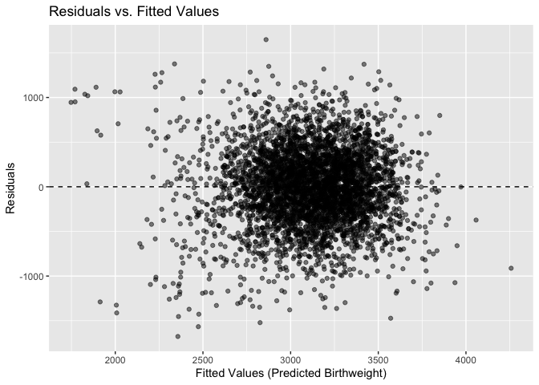
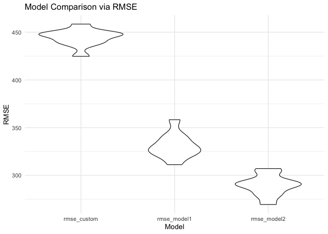
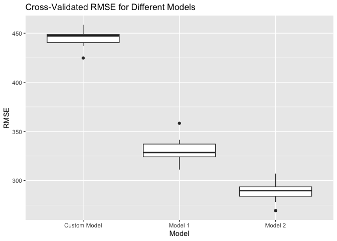

p8105_hw6_CY2772
================
Chenhui Yan
2024-12-02

``` r
library(dplyr)
```

    ## 
    ## Attaching package: 'dplyr'

    ## The following objects are masked from 'package:stats':
    ## 
    ##     filter, lag

    ## The following objects are masked from 'package:base':
    ## 
    ##     intersect, setdiff, setequal, union

``` r
library(tidyverse)
```

    ## ── Attaching core tidyverse packages ──────────────────────── tidyverse 2.0.0 ──
    ## ✔ forcats   1.0.0     ✔ readr     2.1.5
    ## ✔ ggplot2   3.5.1     ✔ stringr   1.5.1
    ## ✔ lubridate 1.9.3     ✔ tibble    3.2.1
    ## ✔ purrr     1.0.2     ✔ tidyr     1.3.1

    ## ── Conflicts ────────────────────────────────────────── tidyverse_conflicts() ──
    ## ✖ dplyr::filter() masks stats::filter()
    ## ✖ dplyr::lag()    masks stats::lag()
    ## ℹ Use the conflicted package (<http://conflicted.r-lib.org/>) to force all conflicts to become errors

``` r
library(broom)
library(ggplot2)
library(forcats) 
library(rsample) 
library(modelr)
```

    ## 
    ## Attaching package: 'modelr'
    ## 
    ## The following object is masked from 'package:broom':
    ## 
    ##     bootstrap

# Problem 2

## 2a) Data cleaning

``` r
homicide = read_csv("./homicide-data.csv") %>%
  # Replace "Unknown" with NA in victim_age
  mutate(victim_age = na_if(victim_age, "Unknown")) %>%
  # Unite city and state
  unite(col = "city_state", city, state, sep = ", ", remove = TRUE) %>%
  # Continue with data cleaning
  mutate(
    solved_bin = if_else(disposition == "Closed by arrest", 1, 0),
    victim_age = parse_number(victim_age),
    victim_race = factor(victim_race, levels = c("White", "Black")),
    victim_sex = factor(victim_sex)
  ) %>%
  # Apply filters
  filter(
    !city_state %in% c("Dallas, TX", "Phoenix, AZ", "Kansas City, MO", "Tulsa, AL"),
    victim_race %in% c("White", "Black")
  )
```

    ## Rows: 52179 Columns: 12
    ## ── Column specification ────────────────────────────────────────────────────────
    ## Delimiter: ","
    ## chr (9): uid, victim_last, victim_first, victim_race, victim_age, victim_sex...
    ## dbl (3): reported_date, lat, lon
    ## 
    ## ℹ Use `spec()` to retrieve the full column specification for this data.
    ## ℹ Specify the column types or set `show_col_types = FALSE` to quiet this message.

``` r
homicide = homicide %>%
  filter(!is.na(victim_age))
```

## 2b1) Define the Logistic Regression Function

``` r
# Define the Logistic Regression Function
fit_logistic_regression <- function(data) {
  model = glm(
    solved_bin ~ victim_age + victim_race + victim_sex,
    family = binomial(),
    data = data
  )
  
  # Tidy the model output with exponentiated estimates and confidence intervals
  tidy_model = tidy(model, exponentiate = TRUE, conf.int = TRUE)
  
  # Extract the row corresponding to 'victim_sexMale'
  sex_term = tidy_model %>%
    filter(term == "victim_sexMale")
  
  # Check if 'victim_sexMale' exists in the model
  if (nrow(sex_term) == 1) {
    result <- sex_term %>%
      select(
        odds_ratio = estimate,
        conf_lower_95 = conf.low,
        conf_upper_95 = conf.high
      )
  } else {
   
    result <- tibble(
      odds_ratio = NA_real_,
      conf_lower_95 = NA_real_,
      conf_upper_95 = NA_real_
    )
  }
  
  return(result)
}
```

## 2b) Glm for Baltimore, MD

``` r
baltimore = homicide %>%
  filter(city_state == "Baltimore, MD") %>%
  mutate(
    victim_age = as.numeric(victim_age),
    victim_race = factor(victim_race),
    victim_sex = factor(victim_sex)
  )

# Fit the logistic regression model
baltimore_glm <- glm(
  solved_bin ~ victim_age + victim_race + victim_sex,
  data = baltimore,
  family = binomial()
)

# Get tidy results with exponentiated estimates and confidence intervals
baltimore_results <- tidy(
  baltimore_glm,
  exponentiate = TRUE,
  conf.int = TRUE
) %>%
  filter(term == "victim_sexMale") %>%
  select(
    term,
    odds_ratio = estimate,
    conf_lower_95 = conf.low,
    conf_upper_95 = conf.high
  )

# Display the results
print(baltimore_results)
```

    ## # A tibble: 1 × 4
    ##   term           odds_ratio conf_lower_95 conf_upper_95
    ##   <chr>               <dbl>         <dbl>         <dbl>
    ## 1 victim_sexMale      0.426         0.324         0.558

## 2C) Apply for every city

``` r
# Apply the Logistic Regression Function Across Cities
city_or_results <- homicide %>%
  group_by(city_state) %>%
  nest() %>%
  mutate(
    glm_results = map(data, fit_logistic_regression)
  ) %>%
  unnest(cols = glm_results) %>%
  select(city_state, odds_ratio, conf_lower_95, conf_upper_95)
```

    ## Warning: There were 43 warnings in `mutate()`.
    ## The first warning was:
    ## ℹ In argument: `glm_results = map(data, fit_logistic_regression)`.
    ## ℹ In group 1: `city_state = "Albuquerque, NM"`.
    ## Caused by warning:
    ## ! glm.fit: fitted probabilities numerically 0 or 1 occurred
    ## ℹ Run `dplyr::last_dplyr_warnings()` to see the 42 remaining warnings.

``` r
# Clean and Prepare the Final Statistics
homicide_stat <- city_or_results %>%
  mutate(
    city_state = as.factor(city_state)
  ) %>%
  rename(
    "Log_OR" = "odds_ratio",
    "CI_Lower_95" = "conf_lower_95",
    "CI_Upper_95" = "conf_upper_95"
  ) %>%
  drop_na(Log_OR, CI_Lower_95, CI_Upper_95)  # Optional: Remove rows with NA values

# Display the Results as a Neatly Formatted Table
knitr::kable(homicide_stat, 
             caption = "Adjusted Odds Ratios for Solving Homicides by Victim Sex Across Cities",
             digits = 3)
```

| city_state         | Log_OR | CI_Lower_95 | CI_Upper_95 |
|:-------------------|-------:|------------:|------------:|
| Albuquerque, NM    |  1.767 |       0.825 |       3.762 |
| Atlanta, GA        |  1.000 |       0.680 |       1.458 |
| Baltimore, MD      |  0.426 |       0.324 |       0.558 |
| Baton Rouge, LA    |  0.381 |       0.204 |       0.684 |
| Birmingham, AL     |  0.870 |       0.571 |       1.314 |
| Boston, MA         |  0.674 |       0.353 |       1.277 |
| Buffalo, NY        |  0.521 |       0.288 |       0.936 |
| Charlotte, NC      |  0.884 |       0.551 |       1.391 |
| Chicago, IL        |  0.410 |       0.336 |       0.501 |
| Cincinnati, OH     |  0.400 |       0.231 |       0.667 |
| Columbus, OH       |  0.532 |       0.377 |       0.748 |
| Denver, CO         |  0.479 |       0.233 |       0.962 |
| Detroit, MI        |  0.582 |       0.462 |       0.734 |
| Durham, NC         |  0.812 |       0.382 |       1.658 |
| Fort Worth, TX     |  0.669 |       0.394 |       1.121 |
| Fresno, CA         |  1.335 |       0.567 |       3.048 |
| Houston, TX        |  0.711 |       0.557 |       0.906 |
| Indianapolis, IN   |  0.919 |       0.678 |       1.241 |
| Jacksonville, FL   |  0.720 |       0.536 |       0.965 |
| Las Vegas, NV      |  0.837 |       0.606 |       1.151 |
| Long Beach, CA     |  0.410 |       0.143 |       1.024 |
| Los Angeles, CA    |  0.662 |       0.457 |       0.954 |
| Louisville, KY     |  0.491 |       0.301 |       0.784 |
| Memphis, TN        |  0.723 |       0.526 |       0.984 |
| Miami, FL          |  0.515 |       0.304 |       0.873 |
| Milwaukee, wI      |  0.727 |       0.495 |       1.054 |
| Minneapolis, MN    |  0.947 |       0.476 |       1.881 |
| Nashville, TN      |  1.034 |       0.681 |       1.556 |
| New Orleans, LA    |  0.585 |       0.422 |       0.812 |
| New York, NY       |  0.262 |       0.133 |       0.485 |
| Oakland, CA        |  0.563 |       0.364 |       0.867 |
| Oklahoma City, OK  |  0.974 |       0.623 |       1.520 |
| Omaha, NE          |  0.382 |       0.199 |       0.711 |
| Philadelphia, PA   |  0.496 |       0.376 |       0.650 |
| Pittsburgh, PA     |  0.431 |       0.263 |       0.696 |
| Richmond, VA       |  1.006 |       0.483 |       1.994 |
| San Antonio, TX    |  0.705 |       0.393 |       1.238 |
| Sacramento, CA     |  0.669 |       0.326 |       1.314 |
| Savannah, GA       |  0.867 |       0.419 |       1.780 |
| San Bernardino, CA |  0.500 |       0.166 |       1.462 |
| San Diego, CA      |  0.413 |       0.191 |       0.830 |
| San Francisco, CA  |  0.608 |       0.312 |       1.155 |
| St. Louis, MO      |  0.703 |       0.530 |       0.932 |
| Stockton, CA       |  1.352 |       0.626 |       2.994 |
| Tampa, FL          |  0.808 |       0.340 |       1.860 |
| Tulsa, OK          |  0.976 |       0.609 |       1.544 |
| Washington, DC     |  0.690 |       0.465 |       1.012 |

Adjusted Odds Ratios for Solving Homicides by Victim Sex Across Cities

## 2d) Plot the result

``` r
# Reorder 'city_state' based on Log_OR for better visualization
homicide_stat <- homicide_stat %>%
  mutate(
    city_state = fct_reorder(city_state,    Log_OR)
  )

# Create the Plot
ggplot(homicide_stat, aes(x = city_state, y =   Log_OR, color = city_state)) +
  geom_point(size = 3) +  # Increase point size for better visibility
  geom_errorbar(aes(ymin = CI_Lower_95  , ymax = CI_Upper_95), width = 0.2) +
  coord_flip() +  # Flip coordinates for horizontal alignment
  labs(
    title = "Adjusted Odds Ratios for Solving Homicides by City",
    subtitle = "Comparing Male vs Female Victims",
    x = "City",
    y = "Odds Ratio (Male vs Female Victims)"
  ) +
  theme_minimal() +
  theme(
    legend.position = "none",                   
    plot.title = element_text(size = 16, face = "bold", hjust = 0.5),
    plot.subtitle = element_text(size = 12, hjust = 0.5),
    axis.text = element_text(size = 10),
    axis.title = element_text(size = 12)
  ) +
  geom_hline(yintercept = 1, linetype = "dashed", color = "red")  # Reference line at OR = 1
```

<!-- -->

The plot illustrates how gender influences homicide resolution across
different cities. An odds ratio (OR) above 1 means cases with male
victims are more likely to be solved than those with female victims.
Cities like Albuquerque, NM, and Stockton, CA, have wide confidence
intervals (CIs), indicating uncertainty due to smaller sample sizes.
When a CI does not include 1, the effect is statistically significant.
Conversely, cities with CIs that cross 1, such as Atlanta, GA, show no
significant gender-based difference in resolution likelihood

# Problem 3

## 1a) data cleaning

``` r
birth_data = read_csv("./birthweight.csv")
```

    ## Rows: 4342 Columns: 20
    ## ── Column specification ────────────────────────────────────────────────────────
    ## Delimiter: ","
    ## dbl (20): babysex, bhead, blength, bwt, delwt, fincome, frace, gaweeks, malf...
    ## 
    ## ℹ Use `spec()` to retrieve the full column specification for this data.
    ## ℹ Specify the column types or set `show_col_types = FALSE` to quiet this message.

``` r
str(birth_data)
```

    ## spc_tbl_ [4,342 × 20] (S3: spec_tbl_df/tbl_df/tbl/data.frame)
    ##  $ babysex : num [1:4342] 2 1 2 1 2 1 2 2 1 1 ...
    ##  $ bhead   : num [1:4342] 34 34 36 34 34 33 33 33 36 33 ...
    ##  $ blength : num [1:4342] 51 48 50 52 52 52 46 49 52 50 ...
    ##  $ bwt     : num [1:4342] 3629 3062 3345 3062 3374 ...
    ##  $ delwt   : num [1:4342] 177 156 148 157 156 129 126 140 146 169 ...
    ##  $ fincome : num [1:4342] 35 65 85 55 5 55 96 5 85 75 ...
    ##  $ frace   : num [1:4342] 1 2 1 1 1 1 2 1 1 2 ...
    ##  $ gaweeks : num [1:4342] 39.9 25.9 39.9 40 41.6 ...
    ##  $ malform : num [1:4342] 0 0 0 0 0 0 0 0 0 0 ...
    ##  $ menarche: num [1:4342] 13 14 12 14 13 12 14 12 11 12 ...
    ##  $ mheight : num [1:4342] 63 65 64 64 66 66 72 62 61 64 ...
    ##  $ momage  : num [1:4342] 36 25 29 18 20 23 29 19 13 19 ...
    ##  $ mrace   : num [1:4342] 1 2 1 1 1 1 2 1 1 2 ...
    ##  $ parity  : num [1:4342] 3 0 0 0 0 0 0 0 0 0 ...
    ##  $ pnumlbw : num [1:4342] 0 0 0 0 0 0 0 0 0 0 ...
    ##  $ pnumsga : num [1:4342] 0 0 0 0 0 0 0 0 0 0 ...
    ##  $ ppbmi   : num [1:4342] 26.3 21.3 23.6 21.8 21 ...
    ##  $ ppwt    : num [1:4342] 148 128 137 127 130 115 105 119 105 145 ...
    ##  $ smoken  : num [1:4342] 0 0 1 10 1 0 0 0 0 4 ...
    ##  $ wtgain  : num [1:4342] 29 28 11 30 26 14 21 21 41 24 ...
    ##  - attr(*, "spec")=
    ##   .. cols(
    ##   ..   babysex = col_double(),
    ##   ..   bhead = col_double(),
    ##   ..   blength = col_double(),
    ##   ..   bwt = col_double(),
    ##   ..   delwt = col_double(),
    ##   ..   fincome = col_double(),
    ##   ..   frace = col_double(),
    ##   ..   gaweeks = col_double(),
    ##   ..   malform = col_double(),
    ##   ..   menarche = col_double(),
    ##   ..   mheight = col_double(),
    ##   ..   momage = col_double(),
    ##   ..   mrace = col_double(),
    ##   ..   parity = col_double(),
    ##   ..   pnumlbw = col_double(),
    ##   ..   pnumsga = col_double(),
    ##   ..   ppbmi = col_double(),
    ##   ..   ppwt = col_double(),
    ##   ..   smoken = col_double(),
    ##   ..   wtgain = col_double()
    ##   .. )
    ##  - attr(*, "problems")=<externalptr>

``` r
birth_data = birth_data %>% 
  mutate(
    babysex = factor(babysex, levels = c(1, 2), labels = c("Male", "Female")),
    frace = factor(frace),
    mrace = factor(mrace),
    malform = factor(malform)
  ) %>% 
  drop_na()
summary(birth_data)
```

    ##    babysex         bhead          blength           bwt           delwt      
    ##  Male  :2230   Min.   :21.00   Min.   :20.00   Min.   : 595   Min.   : 86.0  
    ##  Female:2112   1st Qu.:33.00   1st Qu.:48.00   1st Qu.:2807   1st Qu.:131.0  
    ##                Median :34.00   Median :50.00   Median :3132   Median :143.0  
    ##                Mean   :33.65   Mean   :49.75   Mean   :3114   Mean   :145.6  
    ##                3rd Qu.:35.00   3rd Qu.:51.00   3rd Qu.:3459   3rd Qu.:157.0  
    ##                Max.   :41.00   Max.   :63.00   Max.   :4791   Max.   :334.0  
    ##     fincome      frace       gaweeks      malform     menarche    
    ##  Min.   : 0.00   1:2123   Min.   :17.70   0:4327   Min.   : 0.00  
    ##  1st Qu.:25.00   2:1911   1st Qu.:38.30   1:  15   1st Qu.:12.00  
    ##  Median :35.00   3:  46   Median :39.90            Median :12.00  
    ##  Mean   :44.11   4: 248   Mean   :39.43            Mean   :12.51  
    ##  3rd Qu.:65.00   8:  14   3rd Qu.:41.10            3rd Qu.:13.00  
    ##  Max.   :96.00            Max.   :51.30            Max.   :19.00  
    ##     mheight          momage     mrace        parity            pnumlbw 
    ##  Min.   :48.00   Min.   :12.0   1:2147   Min.   :0.000000   Min.   :0  
    ##  1st Qu.:62.00   1st Qu.:18.0   2:1909   1st Qu.:0.000000   1st Qu.:0  
    ##  Median :63.00   Median :20.0   3:  43   Median :0.000000   Median :0  
    ##  Mean   :63.49   Mean   :20.3   4: 243   Mean   :0.002303   Mean   :0  
    ##  3rd Qu.:65.00   3rd Qu.:22.0            3rd Qu.:0.000000   3rd Qu.:0  
    ##  Max.   :77.00   Max.   :44.0            Max.   :6.000000   Max.   :0  
    ##     pnumsga      ppbmi            ppwt           smoken           wtgain      
    ##  Min.   :0   Min.   :13.07   Min.   : 70.0   Min.   : 0.000   Min.   :-46.00  
    ##  1st Qu.:0   1st Qu.:19.53   1st Qu.:110.0   1st Qu.: 0.000   1st Qu.: 15.00  
    ##  Median :0   Median :21.03   Median :120.0   Median : 0.000   Median : 22.00  
    ##  Mean   :0   Mean   :21.57   Mean   :123.5   Mean   : 4.145   Mean   : 22.08  
    ##  3rd Qu.:0   3rd Qu.:22.91   3rd Qu.:134.0   3rd Qu.: 5.000   3rd Qu.: 28.00  
    ##  Max.   :0   Max.   :46.10   Max.   :287.0   Max.   :60.000   Max.   : 89.00

## 2) Propose and Fit a Regression Model for Birthweight

``` r
# Fit the initial regression model
model_initial = lm(bwt ~ gaweeks + ppbmi + smoken + malform + babysex + frace + mrace + momage + wtgain, 
                    data = birth_data)

# Summarize the model
summary(model_initial)
```

    ## 
    ## Call:
    ## lm(formula = bwt ~ gaweeks + ppbmi + smoken + malform + babysex + 
    ##     frace + mrace + momage + wtgain, data = birth_data)
    ## 
    ## Residuals:
    ##     Min      1Q  Median      3Q     Max 
    ## -1677.0  -261.8     5.9   273.5  1648.1 
    ## 
    ## Coefficients:
    ##                Estimate Std. Error t value Pr(>|t|)    
    ## (Intercept)    516.9743    98.8435   5.230 1.77e-07 ***
    ## gaweeks         53.7919     2.1264  25.297  < 2e-16 ***
    ## ppbmi           19.8714     2.0828   9.541  < 2e-16 ***
    ## smoken         -11.5760     0.9084 -12.743  < 2e-16 ***
    ## malform1       -61.8600   110.7269  -0.559  0.57641    
    ## babysexFemale  -84.6313    13.0168  -6.502 8.84e-11 ***
    ## frace2         -97.5942    72.2280  -1.351  0.17670    
    ## frace3         -46.9458   108.6391  -0.432  0.66567    
    ## frace4         -89.0508    69.9958  -1.272  0.20336    
    ## frace8         -35.1047   116.0634  -0.302  0.76232    
    ## mrace2        -194.8281    72.1652  -2.700  0.00697 ** 
    ## mrace3         -95.8630   112.6353  -0.851  0.39477    
    ## mrace4         -99.8904    70.4348  -1.418  0.15621    
    ## momage           2.9170     1.8257   1.598  0.11018    
    ## wtgain           9.9170     0.6078  16.316  < 2e-16 ***
    ## ---
    ## Signif. codes:  0 '***' 0.001 '**' 0.01 '*' 0.05 '.' 0.1 ' ' 1
    ## 
    ## Residual standard error: 427.4 on 4327 degrees of freedom
    ## Multiple R-squared:  0.3057, Adjusted R-squared:  0.3035 
    ## F-statistic: 136.1 on 14 and 4327 DF,  p-value: < 2.2e-16

``` r
# Add predictions and residuals to the dataset
birthweight = birth_data %>%
  add_predictions(model_initial, var = "pred") %>%
  add_residuals(model_initial, var = "resid")

# Plot residuals vs. fitted values
ggplot(birthweight, aes(x = pred, y = resid)) +
  geom_point(alpha = 0.5) +
  geom_hline(yintercept = 0, linetype = "dashed") +
  labs(
    title = "Residuals vs. Fitted Values",
    x = "Fitted Values (Predicted Birthweight)",
    y = "Residuals"
  )
```

<!-- -->

## 3a) Compare the Model to Two Others

``` r
# Model 1: Using length at birth and gestational age as predictors (main effects only).
model1 <- lm(bwt ~ blength + gaweeks, data = birthweight)
# Model 2: Using head circumference, length, sex, and all interactions (including the three-way interaction).
model2 <- lm(bwt ~ bhead * blength * babysex, data = birthweight)
```

## 3b) Set Up Cross-Validation

``` r
# Set seed for reproducibility
set.seed(123)

# Generate Monte Carlo cross-validation splits
cv_splits = mc_cv(birthweight, times = 10, prop = 0.8)
# Function to compute RMSE for a given model and test data
compute_rmse = function(model, test_data) {
  predictions = predict(model, newdata = test_data)
  sqrt(mean((test_data$bwt - predictions)^2))
}
# Function to fit models and compute RMSEs for one split
compute_rmse_split = function(split) {
  train_data = analysis(split)
  test_data = assessment(split)
  
  # Fit models on training data
  model_custom_cv = lm(bwt ~ gaweeks + babysex + momage + wtgain + smoken +
                          parity + malform + ppbmi, data = train_data)
  model1_cv = lm(bwt ~ blength + gaweeks, data = train_data)
  model2_cv = lm(bwt ~ bhead * blength * babysex, data = train_data)
  
  # Compute RMSEs on test data
  tibble(
    rmse_custom = compute_rmse(model_custom_cv, test_data),
    rmse_model1 = compute_rmse(model1_cv, test_data),
    rmse_model2 = compute_rmse(model2_cv, test_data)
  )
}
# Apply the function to all splits and collect RMSEs
rmse_results = cv_splits %>%
  mutate(rmse = map(splits, compute_rmse_split)) %>%
  unnest(rmse)
# Calculate mean RMSEs for each model
rmse_summary <- rmse_results %>%
  summarise(
    mean_rmse_custom = mean(rmse_custom),
    mean_rmse_model1 = mean(rmse_model1),
    mean_rmse_model2 = mean(rmse_model2)
  )

print(rmse_summary)
```

    ## # A tibble: 1 × 3
    ##   mean_rmse_custom mean_rmse_model1 mean_rmse_model2
    ##              <dbl>            <dbl>            <dbl>
    ## 1             444.             331.             290.

``` r
rmse_long = rmse_results %>%
  pivot_longer(
    cols = starts_with("rmse_"),
    names_to = "model",
    values_to = "rmse"
  )
# Violin plot for RMSE distribution
ggplot(rmse_long, aes(x = model, y = rmse)) +
  geom_violin() +
  labs(
    title = "Model Comparison via RMSE",
    x = "Model",
    y = "RMSE"
  ) +
  theme_minimal()
```

<!-- -->

``` r
# Plot RMSE distributions for each model
ggplot(rmse_long, aes(x = model, y = rmse)) +
  geom_boxplot() +
  labs(
    title = "Cross-Validated RMSE for Different Models",
    x = "Model",
    y = "RMSE"
  ) +
  scale_x_discrete(labels = c("Custom Model", "Model 1", "Model 2"))
```

<!-- -->

As a result, the model using head circumference, length, sex, and all
interactions (including the three-way interaction) between these
variables is optimal.
