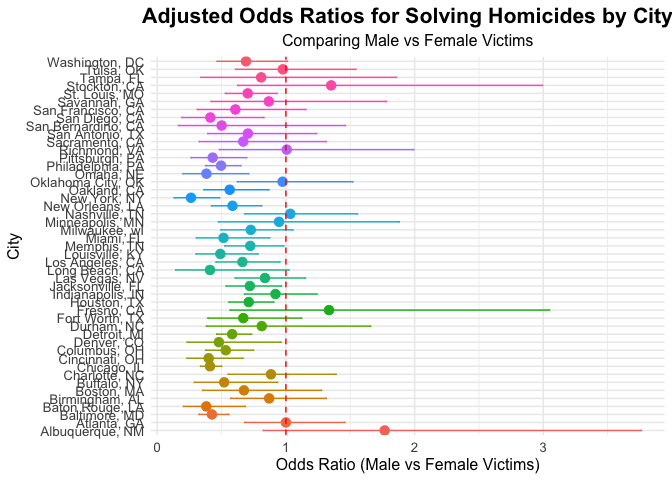

p8105_hw6_CY2772
================
Chenhui Yan
2024-12-02

``` r
library(dplyr)
```

    ## 
    ## Attaching package: 'dplyr'

    ## The following objects are masked from 'package:stats':
    ## 
    ##     filter, lag

    ## The following objects are masked from 'package:base':
    ## 
    ##     intersect, setdiff, setequal, union

``` r
library(tidyverse)
```

    ## ── Attaching core tidyverse packages ──────────────────────── tidyverse 2.0.0 ──
    ## ✔ forcats   1.0.0     ✔ readr     2.1.5
    ## ✔ ggplot2   3.5.1     ✔ stringr   1.5.1
    ## ✔ lubridate 1.9.3     ✔ tibble    3.2.1
    ## ✔ purrr     1.0.2     ✔ tidyr     1.3.1

    ## ── Conflicts ────────────────────────────────────────── tidyverse_conflicts() ──
    ## ✖ dplyr::filter() masks stats::filter()
    ## ✖ dplyr::lag()    masks stats::lag()
    ## ℹ Use the conflicted package (<http://conflicted.r-lib.org/>) to force all conflicts to become errors

``` r
library(broom)
library(ggplot2)
library(forcats) 
```

\#Problem 2 \## 2a) Data cleaning

``` r
homicide = read_csv("./homicide-data.csv") %>%
  # Replace "Unknown" with NA in victim_age
  mutate(victim_age = na_if(victim_age, "Unknown")) %>%
  # Unite city and state
  unite(col = "city_state", city, state, sep = ", ", remove = TRUE) %>%
  # Continue with data cleaning
  mutate(
    solved_bin = if_else(disposition == "Closed by arrest", 1, 0),
    victim_age = parse_number(victim_age),
    victim_race = factor(victim_race, levels = c("White", "Black")),
    victim_sex = factor(victim_sex)
  ) %>%
  # Apply filters
  filter(
    !city_state %in% c("Dallas, TX", "Phoenix, AZ", "Kansas City, MO", "Tulsa, AL"),
    victim_race %in% c("White", "Black")
  )
```

    ## Rows: 52179 Columns: 12
    ## ── Column specification ────────────────────────────────────────────────────────
    ## Delimiter: ","
    ## chr (9): uid, victim_last, victim_first, victim_race, victim_age, victim_sex...
    ## dbl (3): reported_date, lat, lon
    ## 
    ## ℹ Use `spec()` to retrieve the full column specification for this data.
    ## ℹ Specify the column types or set `show_col_types = FALSE` to quiet this message.

``` r
homicide = homicide %>%
  filter(!is.na(victim_age))
```

## Define the Logistic Regression Function

``` r
# Define the Logistic Regression Function
fit_logistic_regression <- function(data) {
  # Fit the logistic regression model
  model <- glm(
    solved_bin ~ victim_age + victim_race + victim_sex,
    family = binomial(),
    data = data
  )
  
  # Tidy the model output with exponentiated estimates and confidence intervals
  tidy_model <- tidy(model, exponentiate = TRUE, conf.int = TRUE)
  
  # Extract the row corresponding to 'victim_sexMale'
  sex_term <- tidy_model %>%
    filter(term == "victim_sexMale")
  
  # Check if 'victim_sexMale' exists in the model
  if (nrow(sex_term) == 1) {
    result <- sex_term %>%
      select(
        odds_ratio = estimate,
        conf_lower_95 = conf.low,
        conf_upper_95 = conf.high
      )
  } else {
    # If the term is missing (e.g., due to lack of variation), return NA values
    result <- tibble(
      odds_ratio = NA_real_,
      conf_lower_95 = NA_real_,
      conf_upper_95 = NA_real_
    )
  }
  
  return(result)
}
```

## 2b) Glm for Baltimore, MD

``` r
baltimore = homicide %>%
  filter(city_state == "Baltimore, MD") %>%
  mutate(
    victim_age = as.numeric(victim_age),
    victim_race = factor(victim_race),
    victim_sex = factor(victim_sex)
  )

# Fit the logistic regression model
baltimore_glm <- glm(
  solved_bin ~ victim_age + victim_race + victim_sex,
  data = baltimore,
  family = binomial()
)

# Get tidy results with exponentiated estimates and confidence intervals
baltimore_results <- tidy(
  baltimore_glm,
  exponentiate = TRUE,
  conf.int = TRUE
) %>%
  filter(term == "victim_sexMale") %>%
  select(
    term,
    odds_ratio = estimate,
    conf_lower_95 = conf.low,
    conf_upper_95 = conf.high
  )

# Display the results
print(baltimore_results)
```

    ## # A tibble: 1 × 4
    ##   term           odds_ratio conf_lower_95 conf_upper_95
    ##   <chr>               <dbl>         <dbl>         <dbl>
    ## 1 victim_sexMale      0.426         0.324         0.558

## 2C) Apply for every city

``` r
# Apply the Logistic Regression Function Across Cities
city_or_results <- homicide %>%
  group_by(city_state) %>%
  nest() %>%
  mutate(
    glm_results = map(data, fit_logistic_regression)
  ) %>%
  unnest(cols = glm_results) %>%
  select(city_state, odds_ratio, conf_lower_95, conf_upper_95)
```

    ## Warning: There were 43 warnings in `mutate()`.
    ## The first warning was:
    ## ℹ In argument: `glm_results = map(data, fit_logistic_regression)`.
    ## ℹ In group 1: `city_state = "Albuquerque, NM"`.
    ## Caused by warning:
    ## ! glm.fit: fitted probabilities numerically 0 or 1 occurred
    ## ℹ Run `dplyr::last_dplyr_warnings()` to see the 42 remaining warnings.

``` r
# Clean and Prepare the Final Statistics
homicide_stat <- city_or_results %>%
  mutate(
    city_state = as.factor(city_state)
  ) %>%
  rename(
    "Log_OR" = "odds_ratio",
    "CI_Lower_95" = "conf_lower_95",
    "CI_Upper_95" = "conf_upper_95"
  ) %>%
  drop_na(Log_OR, CI_Lower_95, CI_Upper_95)  # Optional: Remove rows with NA values

# Display the Results as a Neatly Formatted Table
knitr::kable(homicide_stat, 
             caption = "Adjusted Odds Ratios for Solving Homicides by Victim Sex Across Cities",
             digits = 3)
```

| city_state         | Log_OR | CI_Lower_95 | CI_Upper_95 |
|:-------------------|-------:|------------:|------------:|
| Albuquerque, NM    |  1.767 |       0.825 |       3.762 |
| Atlanta, GA        |  1.000 |       0.680 |       1.458 |
| Baltimore, MD      |  0.426 |       0.324 |       0.558 |
| Baton Rouge, LA    |  0.381 |       0.204 |       0.684 |
| Birmingham, AL     |  0.870 |       0.571 |       1.314 |
| Boston, MA         |  0.674 |       0.353 |       1.277 |
| Buffalo, NY        |  0.521 |       0.288 |       0.936 |
| Charlotte, NC      |  0.884 |       0.551 |       1.391 |
| Chicago, IL        |  0.410 |       0.336 |       0.501 |
| Cincinnati, OH     |  0.400 |       0.231 |       0.667 |
| Columbus, OH       |  0.532 |       0.377 |       0.748 |
| Denver, CO         |  0.479 |       0.233 |       0.962 |
| Detroit, MI        |  0.582 |       0.462 |       0.734 |
| Durham, NC         |  0.812 |       0.382 |       1.658 |
| Fort Worth, TX     |  0.669 |       0.394 |       1.121 |
| Fresno, CA         |  1.335 |       0.567 |       3.048 |
| Houston, TX        |  0.711 |       0.557 |       0.906 |
| Indianapolis, IN   |  0.919 |       0.678 |       1.241 |
| Jacksonville, FL   |  0.720 |       0.536 |       0.965 |
| Las Vegas, NV      |  0.837 |       0.606 |       1.151 |
| Long Beach, CA     |  0.410 |       0.143 |       1.024 |
| Los Angeles, CA    |  0.662 |       0.457 |       0.954 |
| Louisville, KY     |  0.491 |       0.301 |       0.784 |
| Memphis, TN        |  0.723 |       0.526 |       0.984 |
| Miami, FL          |  0.515 |       0.304 |       0.873 |
| Milwaukee, wI      |  0.727 |       0.495 |       1.054 |
| Minneapolis, MN    |  0.947 |       0.476 |       1.881 |
| Nashville, TN      |  1.034 |       0.681 |       1.556 |
| New Orleans, LA    |  0.585 |       0.422 |       0.812 |
| New York, NY       |  0.262 |       0.133 |       0.485 |
| Oakland, CA        |  0.563 |       0.364 |       0.867 |
| Oklahoma City, OK  |  0.974 |       0.623 |       1.520 |
| Omaha, NE          |  0.382 |       0.199 |       0.711 |
| Philadelphia, PA   |  0.496 |       0.376 |       0.650 |
| Pittsburgh, PA     |  0.431 |       0.263 |       0.696 |
| Richmond, VA       |  1.006 |       0.483 |       1.994 |
| San Antonio, TX    |  0.705 |       0.393 |       1.238 |
| Sacramento, CA     |  0.669 |       0.326 |       1.314 |
| Savannah, GA       |  0.867 |       0.419 |       1.780 |
| San Bernardino, CA |  0.500 |       0.166 |       1.462 |
| San Diego, CA      |  0.413 |       0.191 |       0.830 |
| San Francisco, CA  |  0.608 |       0.312 |       1.155 |
| St. Louis, MO      |  0.703 |       0.530 |       0.932 |
| Stockton, CA       |  1.352 |       0.626 |       2.994 |
| Tampa, FL          |  0.808 |       0.340 |       1.860 |
| Tulsa, OK          |  0.976 |       0.609 |       1.544 |
| Washington, DC     |  0.690 |       0.465 |       1.012 |

Adjusted Odds Ratios for Solving Homicides by Victim Sex Across Cities

## 2d) Plot the result

``` r
# Reorder 'city_state' based on Log_OR for better visualization
homicide_stat <- homicide_stat %>%
  mutate(
    city_state = fct_reorder(city_state,    Log_OR)
  )

# Create the Plot
ggplot(homicide_stat, aes(x = city_state, y =   Log_OR, color = city_state)) +
  geom_point(size = 3) +  # Increase point size for better visibility
  geom_errorbar(aes(ymin = CI_Lower_95  , ymax = CI_Upper_95), width = 0.2) +
  coord_flip() +  # Flip coordinates for horizontal alignment
  labs(
    title = "Adjusted Odds Ratios for Solving Homicides by City",
    subtitle = "Comparing Male vs Female Victims",
    x = "City",
    y = "Odds Ratio (Male vs Female Victims)"
  ) +
  theme_minimal() +
  theme(
    legend.position = "none",                   
    plot.title = element_text(size = 16, face = "bold", hjust = 0.5),
    plot.subtitle = element_text(size = 12, hjust = 0.5),
    axis.text = element_text(size = 10),
    axis.title = element_text(size = 12)
  ) +
  geom_hline(yintercept = 1, linetype = "dashed", color = "red")  # Reference line at OR = 1
```

<!-- -->
